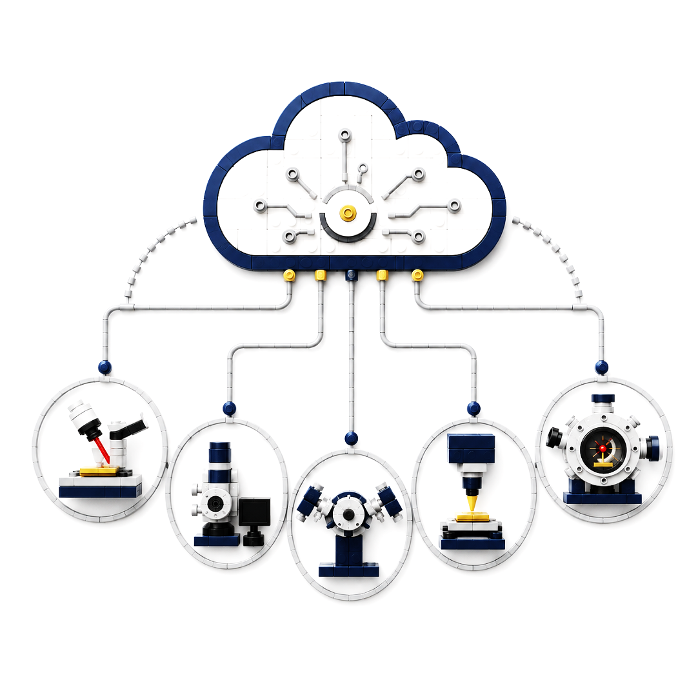
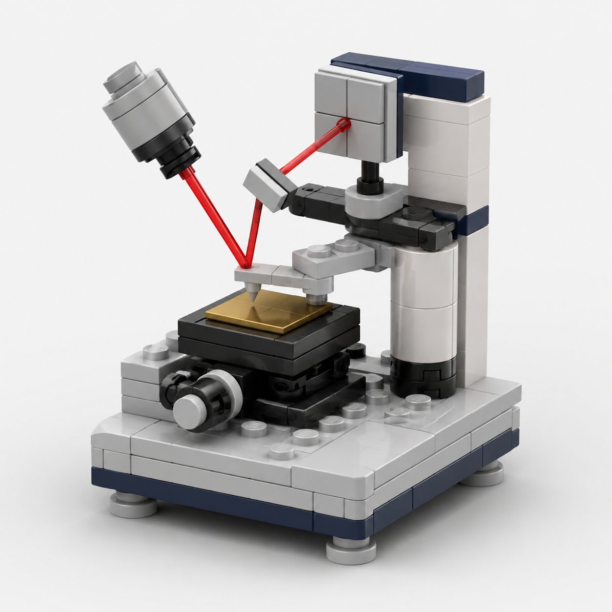
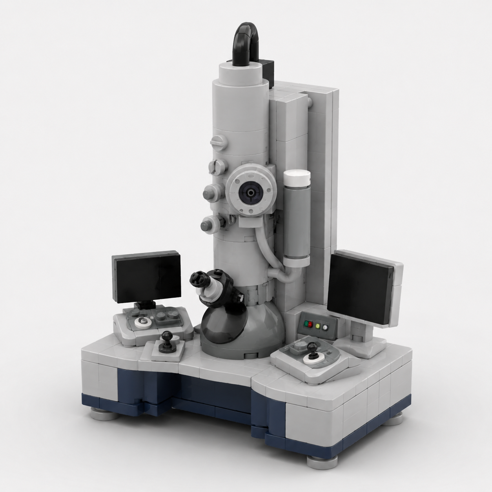
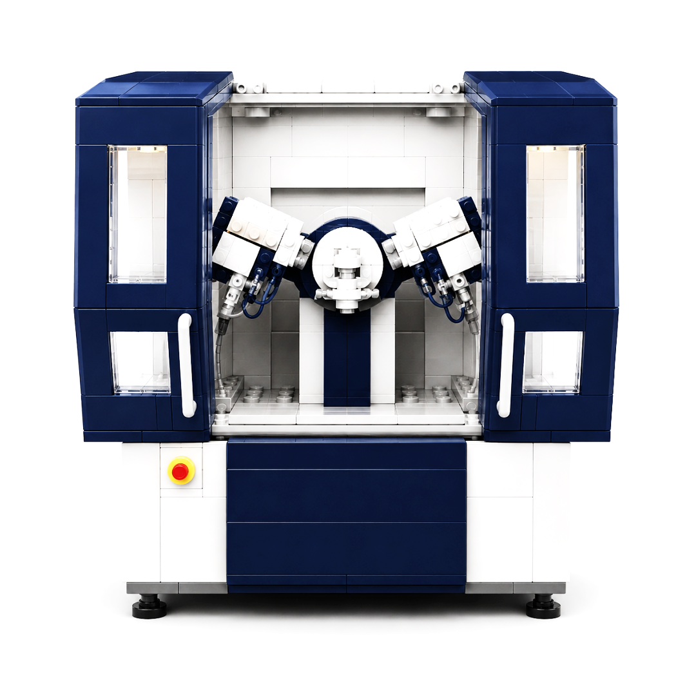
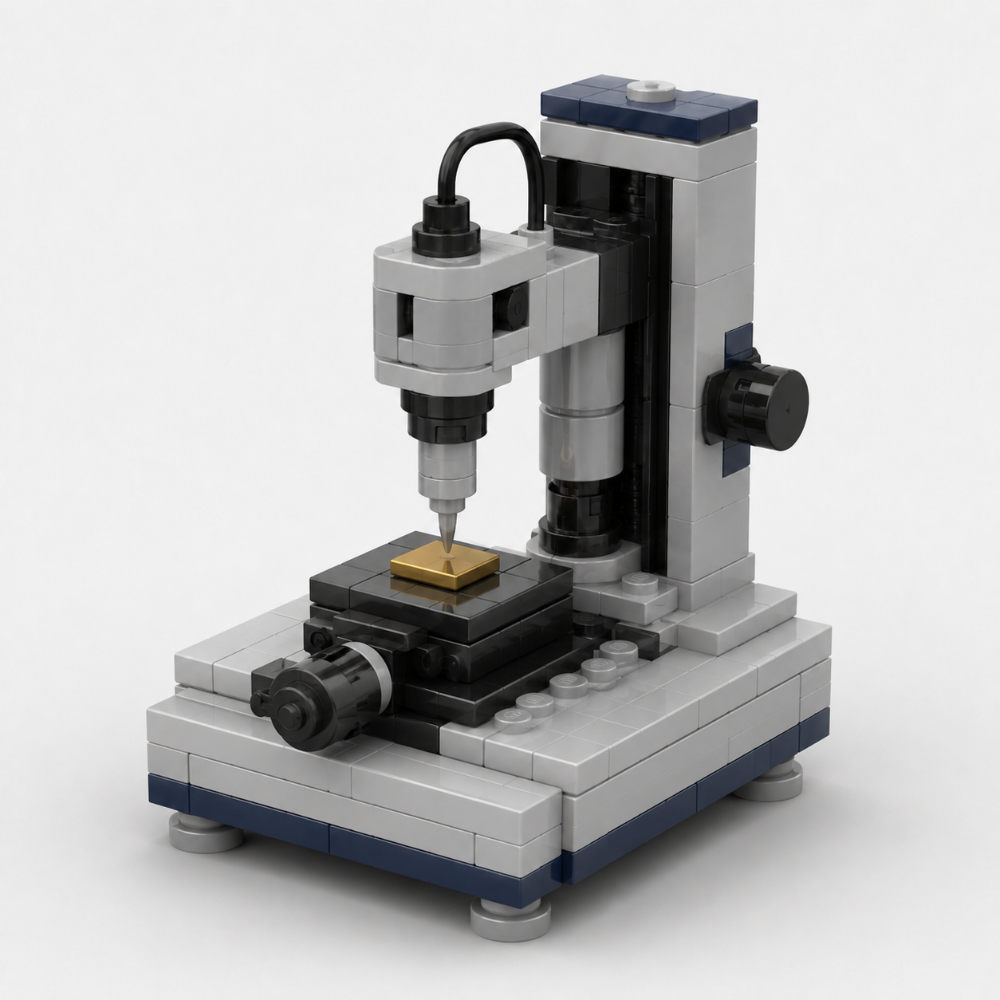
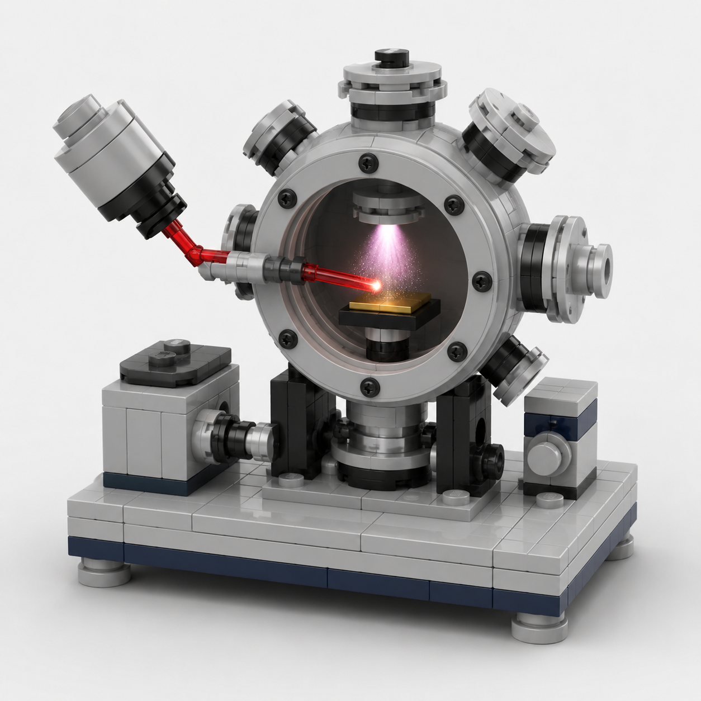

# 🧱 CAMM HACKATHON

## **What if operating scientific instruments felt as simple as having a conversation?**

### **Ask. Connect. Experiment.**

 

 

### A natural-language interface for scientific instrumentation.

Tell CAMM what you want to do.
CAMM helps translate your scientific intent into instrument actions.

 

---

# 💬 **YOU SPEAK SCIENCE.**

# ⚡ **CAMM SPEAKS INSTRUMENT.**

 

### *“Scan this surface.”*

### **Atomic Force Microscopy**

Explore surfaces, morphology, roughness, and nanoscale behavior.

  

### *“Show me what is happening at the atomic scale.”*

### **Electron Microscopy**

Look deeper into structure, defects, interfaces, and atoms.

  

### *“What crystal structure do we have?”*

### **X-Ray Diffraction**

Reveal phases, crystal structure, orientation, and structural changes.

  

### *“How does this material respond mechanically?”*

### **Nanoindentation**

Probe hardness, modulus, and local mechanical response.

  

### *“Let’s make the next material.”*

### **Pulsed Laser Deposition**

Move from characterization to materials synthesis and deposition.

 

---

# ☁️ **ONE PLACE TO START THE CONVERSATION**

 

Instead of beginning with software menus, instrument syntax, or control panels—

## **begin with the scientific question.**

 

**You**

> *“Measure the roughness in this region.”*

### ↓

**CAMM**

`understands your intent`

### ↓

**Instrument**

`performs the requested action`

### ↓

**Result**

`comes back to you`

 

---

# 🔬 **DIFFERENT INSTRUMENTS.**

# **SAME WAY TO INTERACT.**

 

<table>
<tr>
<td align="center">

 
<b>AFM</b>
</td>

<td align="center">

 
<b>Electron Microscopy</b>
</td>

<td align="center">

 
<b>XRD</b>
</td>
</tr>

<tr>
<td align="center">

 
<b>Nanoindentation</b>
</td>

<td align="center">

 
<b>CAMM</b>
</td>

<td align="center">

 
<b>PLD</b>
</td>
</tr>
</table>

 

---

# ✨ **FROM QUESTION TO EXPERIMENT**

### No need to think like the instrument.

### **Let the instrument understand you.**

 

**Describe what you want.**
↓
**Choose where you want to do it.**
↓
**Connect to the instrument.**
↓
**Run the experiment.**
↓
**See what happened.**

 

---

# 🧠 **YOUR QUESTION IS THE INTERFACE.**

 

 

## **Less time talking to software.**

## **More time asking better scientific questions.**

 

### 🧱 `CAMM HACKATHON`

**Talk to your instruments.**

